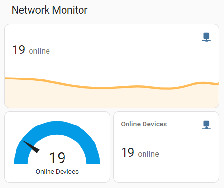
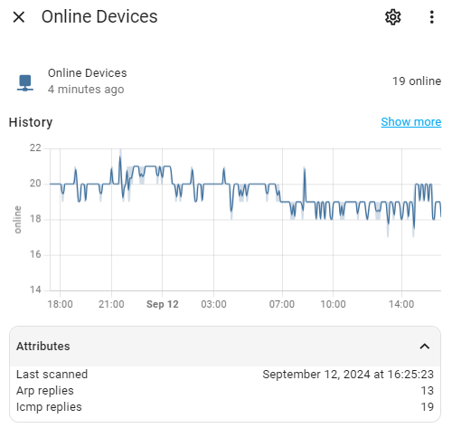

[](https://github.com/custom-components/hacs) 


# Network Monitor Sensor

The **Network Monitor** integration for Home Assistant allows you to monitor the number of devices connected to your local network. This custom sensor leverages the power of network scanning tools to provide real-time data on the number of active devices within a specified IP range.

<p align="center">
  
  
</p>

## Features
- **Custom IP Range**: Specify the IP range to scan, allowing for tailored monitoring of different network segments. Supports multiple formats, including CIDR notation and custom-defined ranges, separated by commas.
- **Real-Time Monitoring**: Regularly updates the count of devices on your network, helping you keep track of connected devices. The scanner can run immediately after completing, only pausing for the pre-defined scan interval.
- **Multiple Protocol**: Utilizes both ICMP and ARP protocols scanning for maximum detection accuracy.

## Use Cases
- **Network Security**: Keep an eye on how many devices are connected to your network and detect unauthorized access.
- **Home Automation**: Trigger automations based on the number of devices connected to your network.
- **Network Management**: Monitor network congestion and usage patterns by tracking device counts over time.

## Installation
[](https://my.home-assistant.io/redirect/hacs_repository/?owner=jjmonteiro&repository=ha-net-monitor&category=Integration)

This integration can also be easily installed via [HACS](https://hacs.xyz/) by adding the repository url to your custom repositories list.

## Configuration
To configure the `Network Monitor` sensor, add the following to your `configuration.yaml`:

```yaml
sensor:
  - platform: net_monitor
    name: My Network Monitor  # Customize the sensor name
    ip_range: 192.168.1.1/24  # Replace with your network's IP range
    scan_interval:            # Optional: Set the interval between scans
      minutes: 5  
      seconds: 0
```
