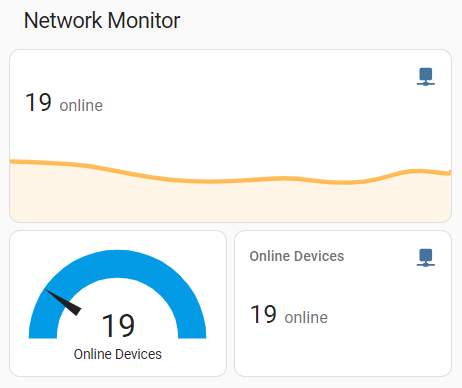
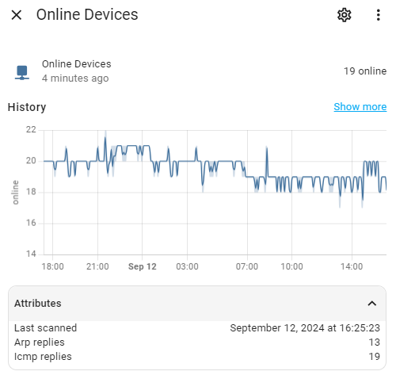

 

# Network Monitor Sensor

The **Network Monitor** integration for Home Assistant allows you to monitor the number of devices connected to your local network. This custom sensor leverages the power of network scanning tools to provide real-time data on the number of active devices within a specified IP range.

  
  

## Features
- **Custom IP Range**: Specify the IP range to scan, allowing for tailored monitoring of different network segments. Supports multiple formats, including CIDR notation and custom-defined ranges, separated by commas.
- **Real-Time Monitoring**: Regularly updates the count of devices on your network, helping you keep track of connected devices. The scanner can run immediately after completing, only pausing for the pre-defined scan interval.
- **Multiple Protocols**: Utilizes both ICMP (ping) and ARP protocols for maximum detection accuracy.
- **MAC Correlation for ARP**: ARP replies are now correlated by MAC address, so each device is only counted once, even if it replies for multiple IPs. This prevents inflated device counts due to proxy ARP or network equipment responding for many IPs.
- **Accurate Device Counting**: The sensor state is the number of unique devices that replied to either ICMP or ARP (union of both sets).
- **Detailed Logging**: Debug logs show the number of ICMP and ARP replies for each scan, and the total number of unique devices found.

## Use Cases
- **Network Security**: Keep an eye on how many devices are connected to your network and detect unauthorized access.
- **Home Automation**: Trigger automations based on the number of devices connected to your network.
- **Network Management**: Monitor network congestion and usage patterns by tracking device counts over time.

## Installation

This integration can also be easily installed via [HACS](https://hacs.xyz/) by adding the repository url to your custom repositories list.

## Configuration
Configuration is now handled entirely via the Home Assistant UI using the built-in Config Flow. You do **not** need to edit `configuration.yaml`.

To set up the Network Monitor integration:
- Go to **Settings > Devices & Services > Integrations** in Home Assistant.
- Click **"Add Integration"** and search for **Network Monitor**.
- Enter your desired sensor name, IP range (CIDR or range), and scan interval.
- You can change these options at any time from the integration's options menu in the UI.

### Sensor State and Attributes
- **State**: Number of unique devices that replied to either ICMP or ARP (union of both sets).
- **Attributes**:
  - `icmp_replies`: Number of unique IPs that replied to ICMP (ping)
  - `arp_replies`: Number of unique MAC addresses (devices) that replied to ARP
  - `last_scan`: Time of the last scan
  - `time_scan`: Duration of the last scan

## Troubleshooting & Notes
- **Inflated Device Counts**: If you previously saw more devices than expected, this was likely due to ARP replies from network equipment (proxy ARP) or multiple IPs per device. The integration now correlates ARP replies by MAC address, so each device is only counted once.
- **Debug Logging**: Enable debug logging for `custom_components.net_monitor` to see detailed scan progress, including the number of ICMP and ARP replies and ongoing progress of the current scan for large networks.
